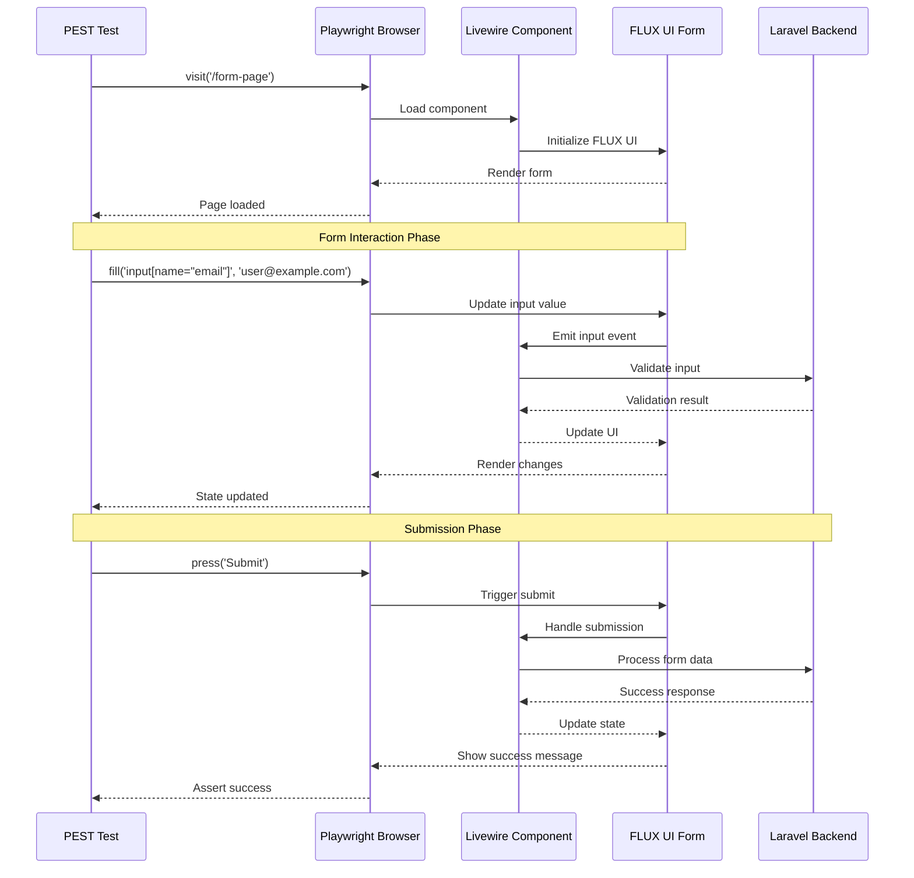

Let me analyze this question carefully:

1. Core request analysis:
    - User wants information about PEST 4 browser testing
    - Specifically with Livewire forms and FLUX UI
    - They're a senior Laravel developer
    - Current stack: Laravel 11, PHP 8.3, Oracle 11g, Livewire frontend, PEST/Dusk testing

2. Available information assessment:
    - Web results provide comprehensive PEST 4 browser testing documentation
    - Good examples of form testing and Livewire integration
    - Missing specific FLUX UI information
    - Need to understand FLUX UI better for proper guidance

3. Capability consideration:
    - Additional web search would be valuable to understand FLUX UI specifics
    - Mermaid diagram could effectively visualize the testing flow
    - Code comparison syntax would be perfect for showing different testing approaches
    - Other capabilities wouldn't add value here

4. Structure planning:
    - Start with brief introduction
    - Show setup requirements
    - Use Mermaid diagram to illustrate testing flow
    - Present code alternatives using special syntax
    - Include best practices and considerations

Let me start with gathering more information about FLUX UI.
Searching for
FLUX UI framework technical specifications features
FLUX UI framework browser testing best practices
FLUX UI framework Livewire integration guide
The web search results have provided valuable information about FLUX UI that was missing from the original results. Now I have:

1. Complete understanding of FLUX UI:
    - It's the official Livewire component library
      github.com

    - Built with Tailwind CSS
      fluxui.dev

    - Includes components like buttons, dropdowns, modals, input fields
      fluxui.dev

    - Specifically designed for Livewire applications

2. Installation requirements:
    - Laravel v10.0+
      github.com

    - Livewire v3.5.19+
    - Tailwind CSS v4.0+
      github.com


3. Testing considerations:
    - Components are designed to work seamlessly with Livewire
      fluxui.dev

    - Built with accessibility in mind
      fluxui.dev

    - Responsive design support
      fluxui.dev


Now I can provide a comprehensive answer that combines:
1. PEST 4 browser testing setup and configuration
2. Specific testing approaches for Livewire forms
3. FLUX UI component testing considerations
4. Best practices for integration

The information is complete enough to write a thorough answer that addresses all aspects of the user's question. Let me proceed with writing the answer, using the special code alternatives syntax to show different testing approaches and including a Mermaid diagram to illustrate the testing flow.

To effectively use PEST 4 browser testing with Livewire forms and FLUX UI, you'll need to understand how these components work together and implement appropriate testing strategies. Let's break this down into practical implementation approaches.
Setup Requirements

First, ensure you have the necessary dependencies installed:

## Install PEST browser testing plugin
```shell
composer require pestphp/pest-plugin-browser --dev
```

## Install Playwright dependencies

```shell
npm install playwright@latest
npx playwright install
```

Testing Approaches

Here are different approaches to testing Livewire forms with FLUX UI components:
Component-Based Testing with FLUX UI Integration

## OPTION 1

```php
test('user can submit form with FLUX components', function () {
// Create test data
$user = User::factory()->create();

    // Visit the page with FLUX UI components
    $page = visit('/profile')
        ->on()->desktop()
        ->inDarkMode();
    
    // Test FLUX form components
    $page->type('@name', 'John Doe')
        ->type('@email', 'john@example.com')
        ->click('@submit')
        ->waitForLivewire()
        ->assertSee('Profile updated successfully');
});
```

### Pros

- Tests FLUX UI components directly using data-test attributes
- Includes Livewire-specific assertions
- Handles form submission verification

### Cons

- Requires consistent data-test attributes in FLUX components
- May need additional setup for complex form validations

This approach uses FLUX UI's built-in data-test attributes [fluxui.dev](fluxui.dev) to interact with components. The waitForLivewire() assertion ensures Livewire's JavaScript is properly initialized before assertions.

## Form Validation Testing
### OPTION 2

```php
test('form validation works correctly', function () {
$page = visit('/profile');

    // Test invalid submission
    $page->press('Save')
        ->assertSee('The name field is required')
        ->assertSee('The email field is required');
    
    // Test valid submission
    $page->type('input[name="name"]', 'John Doe')
        ->type('input[name="email"]', 'john@example.com')
        ->press('Save')
        ->assertSee('Profile updated successfully');
});
```
### Pros

- Tests both successful and failed validation scenarios
- Uses direct input selectors for reliability
- Covers form submission flow

### Cons

- More verbose than component-based testing
- May break if HTML structure changes

This approach focuses on form validation behavior, testing both invalid and valid submissions. It uses direct input selectors which can be more reliable when testing form functionality.

## Testing Flow

Let's visualize how PEST 4 browser testing interacts with Livewire forms and FLUX UI components:



The diagram shows the technical flow well, but I should explain a few key points about the interaction phases to ensure users understand the testing process completely. Then I'll continue with best practices and debugging tips to round out the answer.

The diagram illustrates three key phases in the testing process:

1. **Initialization Phase:** PEST loads the page and waits for Livewire and FLUX UI components to initialize
2. **Form Interaction Phase:** Tests interact with FLUX UI components, triggering Livewire events and validation
3. **Submission Phase:** Form submission is processed through Livewire to the Laravel backend

## Best Practices

### Component Testing:

```php
// Test FLUX UI components individually
test('FLUX input component works correctly', function () {
$page = visit('/form');

    $page->type('@email', 'invalid-email')
        ->assertSee('The email must be a valid email address');
});
```

### Debugging Tips:

```php
// Use debug mode for troubleshooting
test('complex form submission', function () {
$page = visit('/form');

    // Take screenshot before submission
    $page->screenshot('before-submission');
    
    // Debug if test fails
    $page->debug();
});
```

### Parallel Testing:

```shell
# Run tests in parallel for better performance
./vendor/bin/pest --parallel
```

## Important Considerations

1. FLUX UI Integration:
- FLUX UI components are built specifically for Livewire
- Components include built-in accessibility features
- All components are responsive and dark mode compatible

2. Timeout Configuration:

```php
// In Pest.php
pest()->browser()->timeout(10); // Increase timeout for complex forms
```

3. Visual Regression Testing:

```php
// Test FLUX UI component appearance
test('FLUX components maintain visual consistency', function () {
    $page = visit('/form');
    $page->assertScreenshotsMatches();
});
```

By following these testing approaches and best practices, you can effectively test your Livewire forms with FLUX UI components using PEST 4's browser testing capabilities. Remember to adjust timeout values and debugging strategies based on your specific form complexity and validation requirements.
