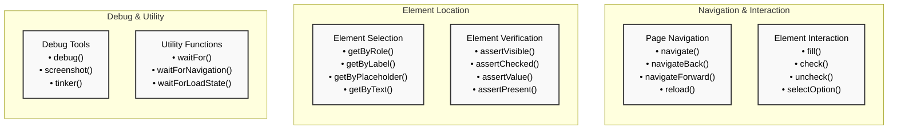

In addition to `click()` and `press()`, PEST provides access to a comprehensive set of Playwright functions for browser testing. Here are the main categories and their functions:

## Navigation and Interaction Functions

```php
// Navigation
$page->navigate('/dashboard');
$page->navigateBack();
$page->navigateForward();
$page->reload();

// Element interaction
$page->fill('input[name="email"]', 'user@example.com');
$page->check('#terms');
$page->uncheck('#terms');
$page->selectOption('select[name="plan"]', 'pro');
```

- Core functions for page navigation and form interaction
- Handles common user interactions
- Supports form filling and selection
- Basic interactions only
- May need additional functions for complex scenarios

These functions handle basic page navigation and form interactions 1:12. They're the foundation for most browser tests and simulate common user actions.

## Element Location and Verification Functions

```php
// Element location
$page->getByRole('button', ['name' => 'Submit']);
$page->getByLabel('Email');
$page->getByPlaceholder('Enter email');

// Verification
$page->assertVisible('form');
$page->assertChecked('#terms');
$page->assertValue('input[name="email"]', 'user@example.com');
```

- Multiple ways to locate elements
- Strong assertion support
- Clear verification methods
- More complex than basic interactions
- Requires understanding of element selectors

These functions provide various ways to locate elements and verify their state 1:9. They're essential for testing complex UI interactions and element properties.
Here's a visual overview of the available Playwright functions in PEST:



### Special Cases and Examples

1. **Debugging Functions**:
   When troubleshooting tests, PEST provides several debugging tools 1:18:

```php
// Open browser for debugging
$page->debug();

// Take screenshot
$page->screenshot('error-state.png');

// Open tinker session
$page->tinker();
```


2. **Waiting Functions**:
   For handling asynchronous operations 1:10:

```php
// Wait for element
$page->waitFor('.loading');

// Wait for navigation
$page->waitForNavigation();

// Wait for load state
$page->waitForLoadState('networkidle');
```


3. **Device and Viewport Functions**:
   For testing different devices and viewports 1:5:

```php
// Test on mobile
$page->on()->mobile();

// Test specific device
$page->on()->iPhone14Pro();

// Test in dark mode
$page->inDarkMode();
```


### Best Practices

1. **Timeout Configuration**: Set appropriate timeouts for your tests 1:10:

```php
// In Pest.php
pest()->browser()->timeout(10); // Increase timeout for complex operations
```


2. **Parallel Testing**: Run tests in parallel for better performance 1:2:
```bash
./vendor/bin/pest --parallel
```


3. **Debug Mode**: Use debug mode when troubleshooting 1:18:
```bash
./vendor/bin/pest --debug
```

These functions provide a comprehensive toolkit for browser testing in PEST, allowing you to simulate complex user interactions, verify UI states, and handle various testing scenarios effectively.
