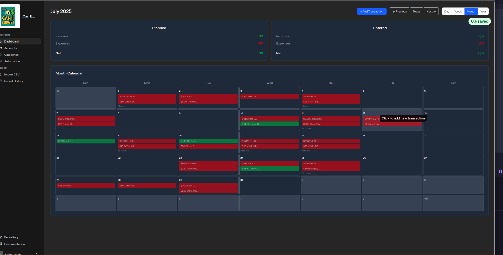

# Planned and Entered calculations on Dashboard

## Issue

1. when viewing the dashboard, the planned and entered amounts are not being calculated. I should be able to use the "previous" and "next" buttons to navigate to the previous month, week or day and see the calculations update.

See the `docs/issues/dashboard-calendar.png` for example.

2. When adding a transaction on today's date or a previous day this will entered transaction and should be added to the entered section. The first thing to update is that the transaction window shows update "Update Expense" and it should be "Enter Expense". Then when the transaction is entered it should show on the calendar with reduced alpha so it does not show as visible. 

3. Transactions should have 2 states, added and entered when it comes to the dashboard. The added state is when the transaction is added to the calendar but not entered. The entered state is when the transaction is entered and reconciled. When I import a CSV file, the transactions should be added to the calendar and not entered. When a transaction is entered, it is confirmed, counted for the entered amount and displayed with the transaction color alpha reduced. 

Here is an example of the transaction window `docs/issues/enter-expense.png`

## Approach
Have a think how to work over the issues and create a plan in `context/todo` for use to work through each issue. Inspect the code, apply suggested changes and request user to confirm changes are working
visually. Once confirmed by user we can look at the current tests for those changes and update or add new tests to cover the changes.
