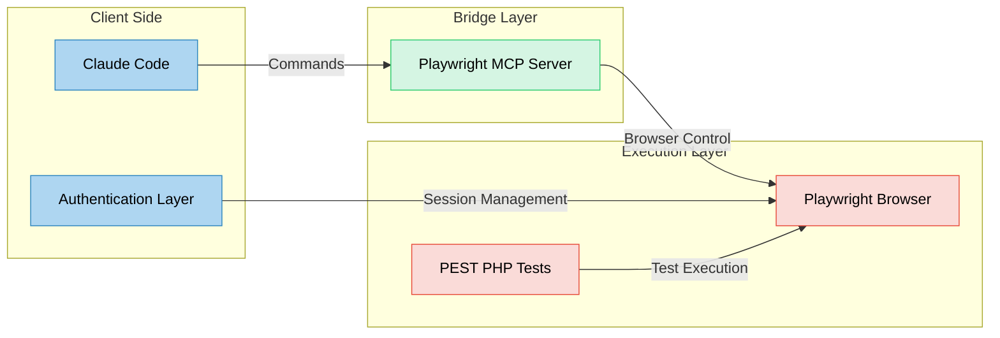

Let me help you set up Playwright MCP with Claude Code specifically for your Laravel 11 application using PEST PHP 4. This integration will allow you to
leverage AI-assisted browser testing within your existing Laravel ecosystem.

### Understanding the Architecture

Before diving into the setup, let's visualize how these components work together:



The diagram shows three main layers:

- **Client Side**: Where you'll interact with Claude Code and manage authentication sessions
- **Bridge Layer**: The Playwright MCP server that translates your commands into browser actions
- **Execution Layer**: Where your PEST PHP tests interact with the actual browser instance

This architecture ensures secure communication between Claude Code and your browser tests while maintaining proper session management for authenticated testing
scenarios.

### Step-by-Step Setup Guide

Install Playwright MCP for Claude Code

```bash
# Run this command in your Laravel project directory
claude mcp add playwright npx '@playwright/mcp@latest'
```

This command sets up the MCP server locally and persists the configuration in your project directory 0:0. Verify Installation- Run `claude` in your terminal
- Type `/mcp` followed by `playwright` to view available tools
- You should see various browser control commands listed 0:2

 Configure PEST PHP 4 for PlaywrightAdd these dependencies to your `composer.json`:

```json
{
    "require-dev": {
        "pestphp/pest": "^4.0",
        "pestphp/pest-plugin-laravel": "^2.0",
        "pestphp/pest-plugin-playwright": "^1.0"
    }
}
```

Then update your dependencies:

```bash
composer update
```

Create Your First TestHere's a basic example using PEST PHP 4 with Playwright:

```php
<?php

test('can perform browser interaction', function () {
    $this->browse(function ($page) {
        // Navigate to your route
        $page->goto('/dashboard');
        
        // Wait for element
        $page->waitForSelector('#app');
        
        // Assert content
        expect($page->textContent('.header-title'))->toContain('Dashboard');
    });
});
```

Authentication HandlingFor authenticated routes in your Laravel application:

```php
<?php

test('authenticated dashboard access', function () {
    // Create or use an existing user
    $user = User::factory()->create();
    
    $this->browse(function ($page) use ($user) {
        // Login using Laravel's session authentication
        $page->loginAs($user);
        
        $page->goto('/dashboard');
        
        expect($page->textContent('.header-title'))->toContain('Dashboard');
    });
});
```

### Important Considerations for Laravel Applications

1. **Environment Variables**  - Store sensitive test data in `.env.testing`

- Never commit sensitive credentials to version control 1:6


2. **Livewire Components**  - Ensure proper waiting mechanisms for dynamic content

- Use specific selectors for Livewire components
- Handle loading states appropriately


3. **Database Transactions**  - Wrap tests in transactions when modifying data

- Clean up test data after execution

### Troubleshooting Common Issues

1. **MCP Connection Problems**  - Verify the MCP server is running

- Check that you're in the correct project directory
- Confirm `~/.claude.json` contains the correct configuration 0:0


2. **Browser Interaction Issues**  - Always wait for elements to be ready before interaction

- Use explicit timeouts for slow-loading components
- Implement retry mechanisms for flaky tests

Remember to update your `phpunit.xml` or `Pest.php` configuration files according to your specific testing requirements. For complex test scenarios, consider
breaking them down into smaller, more manageable test cases to maintain reliability.
